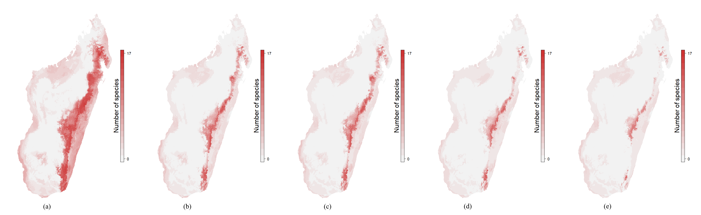

# 3. Results

## Context of our tests

In this project, the area on which we tested the package was the whole island of Madagascar. We chose this area to be in accordance with the project but the package is fully adaptable to other places. Madagascar is very interesting to study in this context because of its rich and abundant biodiversity. Not only there is many species of animals or vegetation but a lot of these are endemic to the isle. Among all the country we could have the necessary data, Madagascar may be the best example. The datas used in the project come from the *REBIOMA* **(SOURCE?)** project that collected a lot of observations of the biodiversity in the whole island of Madagascar. Two of the dataset used in the tests are coming from there : one for baobabs and one for lemurs. To push the tests a little further, we also added data for birds coming from *eBird*. In the end we tested the package on 362 different species (8 of boababs, 71 of lemurs, 283 of birds).

To run the models, we chose 5 climatic and environmental variables. This choice is crucial because the results rely directly on it. We were looking for variables that were the least correlate but though the most complete. One important point to choose these ones was that they are easily interpretable.

-- *Annual Mean Temperature (temp)*

-- *Temperature Seasonability (tseas)*

-- *Annual Precipitation (prec)*

-- *Climatic Water Deficit (cwd)*

-- *Altitude (alt)*

Afterthat we had to choose which future scenarios to study. It was important to have several predictions but not to much either otherwise the calculus time would have been too high. So we favoured the following scenarios :

-- for *Representative Concentration Pathways* : RCP4.5 and RCP8.5. These numbers are W/m^2^, they correspond to scenarios of the planet warming.   

-- for *Global Climate Models* : *Community Climate System Model (CCSM4)* [@CCSM4], *Goddard Institute for Space Studies Model E version 2 with Russell ocean model (GISS-E2-R)* [@GISS-E2-R] and *Hadley Global Environment Model 2 - Earth System (HadGEM2-ES)* [@HadGEM2-ES].

-- for *years* : 2050 and 2080.


## Content of an atlas page

Now we're gonna describe the different items that constitute an atlas page. As said before the output can be *HTML* or *PDF* but the content is strictly the same for both of the mediums. On top of the page there is the name of the species, its taxonomy with the kingdom and the family. When available there's also the authority (name and year) and the IUCN status. It is an endangerment indicator for every species, with different levels of threat like *Least Concern* (LC), *Vulnerable* (VU) or *Critically Endangered* (CR). Below these, there are descriptive image and text (when available) that helps to know which species it is about if its name is not evocative enough. A link to the corresponding *Encyclopedia of Life* page is given for every species. The first map on the top left is showing all the occurences of the species with the map of the area for background. The number of occurences for the species is written on the right of the maps.

Every species have those items in common, but the presence of the other informations depend on the number of occurences for the species. We saw that earlier, we chose not to run the models if the species presented less than 10 observations. For those species, there isn't anything else on the atlas page. For other species with enough inidividuals, the results of the models are presented over several maps and tables. The second map is showing the binary vote for every model concerning the presence of the species. If 3 models or more are considering the presence on a pixel, we admit the species is present there, and it is colored in green on the map. The sum of these presences gives us the *Species distribution area*, which is the predicted number of km^2^ with at least one presence of the species. Also there is a table that shows the values for the effectiveness indicators that were presented earlier. 

On the following section, the graph on the left is presenting the relation between *Annual precipitation* and *Mean annual temperature* : every species is marked by a dot at the intersection of its value for the two variables. It allows us to see if the species only live under certain conditions. For most of the species, those climatic niches are  relatively gathered. On the right of this section, there's firstly a table that informs us on the environmental tendancy for places where individuals of the species where detected. There are the mean and quantiles for every variable studied, it gives an idea on the environment this species need. The second table gives information on the importance of the climatic variables. In other words it designates which are the variables that are conditioning the most the presence of the species. We can read the results for every 5 models of `BIOMOD2`, and there's a synthesis on the two last columns.

The last section of the page is presenting the results obtained for the different future scenarios. The two maps on the left are the extreme cases (RCP8.5 and 2080) with or without dispersion. There's 15 levels on the legend because of the 5 models and the 3 GCMs. For every GCM we have the binary response for every distribution model. That time we consider the species present on a pixel if at least 8 out of 15 answers are positive. Summing these pixels provides us the new *Species distribution area* for this scenario, and we can measure the percentage of variation relative to the projections for the present. Those informations are in the two last columns of the table. 

## Exploitation of the results

With the projections of distribution that `BIOMOD2` is producing, it is possible to make some maps of specific richness, whether by taxon or with all of them. On the Fig. \@ref(fig:lemurs), \@ref(fig:baobabs), \@ref(fig:birds) and \@ref(fig:reptiles), the different figures are standing for : *(a) current*, *(b) 45 and 2050*, *(c) 45 and 2080*, *(d) 85 and 2050* and *(e) 85 and 2080*. 

(ref:cap-lemurs) Specific richness for the lemurs.

(ref:cap-baobabs) Specific richness for the baobabs.

(ref:cap-birds) Specific richness for the birds.

(ref:cap-reptiles) Specific richness for the reptiles.

```{r lemurs, echo=FALSE, out.width="\\textwidth", fig.cap="(ref:cap-lemurs)"}

```
```{r baobabs, echo=FALSE, out.width="\\textwidth", fig.cap="(ref:cap-baobabs)"}
knitr::include_graphics("figures/baobabs.png")
```
```{r birds, echo=FALSE, out.width="\\textwidth", fig.cap="(ref:cap-birds)"}
knitr::include_graphics("figures/birds.png")
```
```{r reptiles, echo=FALSE, out.width="\\textwidth", fig.cap="(ref:cap-reptiles)"}

```