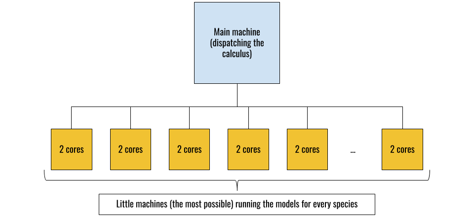

# 4. Discussion

## Applications

The `speciesatlas` package is useful for various reasons. It is a tool designed for site's managers to help them doing their job. The package allows to work with thousands of different species with a single launch, the only limit is the calculation time. In the atlas, the species can be gathered by taxon, or by any category wanted : it just depends on the input data. Finally, there is one synthetic page presenting the results of the models for every species, in the most clear and accessible way. The datas needed to use the package are not that complicated to obtain. Both species' occurences and climatic datas of the place to study can be found in free access, for example with *WorldClim* and *GBIF* (https://www.gbif.org/). The datas might need a little upstream work but that's still very accessible. 

As we saw earlier the files generated by `BIOMOD2` can be used to create specific richness maps, or several kind of biodiversity indicators, this is what we call $\alpha$-diversity. These documents are a really good synthesis of all the informations obtained, they allow to identify the biodiversity hot-spots. Site's managers can rely on those maps to establish their action plan concerning species' preservation. They know which are the most threatened places so they can focus their strength on protecting those from deforestation or illegal poaching.

## Limitations

There obvisouly are some limitations to the package. To make it more user friendly we decided to set the parameters of `BIOMOD2` to particular values and that makes `speciesatlas` less adaptable than `BIOMOD2`. This could have been great to vary the parameters depending on the species currently studied.  The choice of the models itself could be changeable between different species, for example we saw that ANN gave better results for some species but less significant for others.  Also we could be able to indicate different climatic or environmental variables according to the species : not all species are affected by the same variables. Concerning the variables, we only use climatic ones in our tests, it would be interesting to add more environmental ones like the forest cover. These environmental variables aren't necessarly related to the climatic ones so the results would be even more reliable if they were taken in consideration. 

Another limitation of the package is the calculation time. Even with a good computing machine, it may take a long time to run the package. The parallelization of the calculus makes it viable otherwise it would really last too many time. In average, the models take 45 minutes for every species. We see that it is essential to have several cores on the computer. 

## Perspectives

Because it still is in its early stages of development, there are some features that could be add to `speciesatlas`. A major step forward would be to consider the $\beta$-diversity. It involves leading the studies by community of species and not only by individual species. A solid interaction between 2 species won't be considered only using  $\alpha$-diversity, although it may explain the produced results. That would also allow us to produce lists of present species in a given area, which can be very useful.

To face the issue of the calcutation time, online servers could be the solution. Many organisms are offering virtual machines where you can run calculus on. The architecture the most optimised for the use of the package would be the one depicted on (Fig. \@ref(fig:arc)). The fact of having little machines with couples of cores would improve the computing time because the functions of `BIOMOD2` can also be parallelized. For the moment we are not taking advantage of this feature by only parallelizing between each species. 

(ref:cap-arc) The optimised architecture of a virtual machine to run the package.

```{r arc, echo=FALSE, out.width="\\textwidth", fig.cap="(ref:cap-arc)"}

```